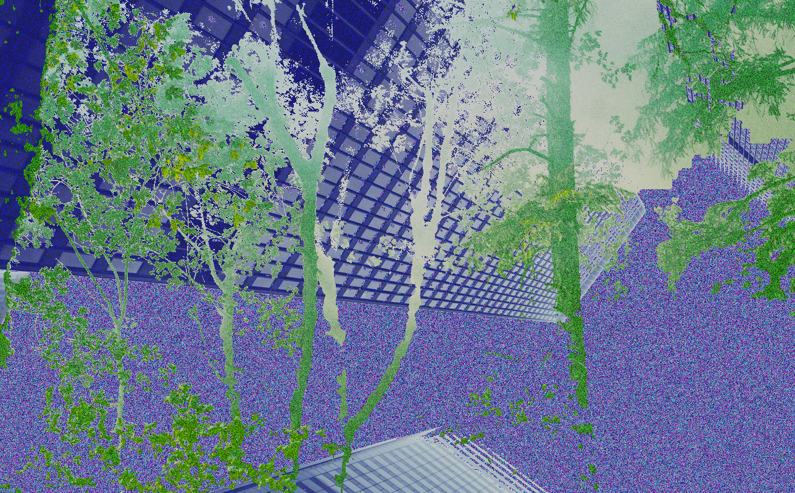
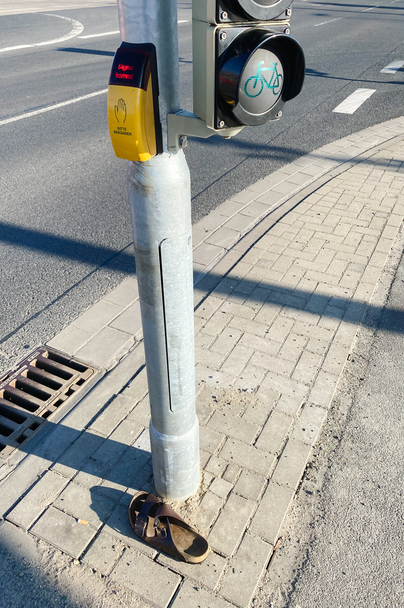

<!DOCTYPE html>
<html lang="en" dir="ltr">
  <head>
    <meta charset="utf-8">
    <title>Jannes Kurt Ulbrich</title>
    <link rel="stylesheet" href="css/style.css">
    <meta name="viewport" content="width=device-width, initial-scale=1">
  </head>

<body>
  <!-- Opener -->
  <!-- 

    

    
enter

    
to enter this place you better find the door

  
 -->
  <!-- Opener -->

  

  <!-- Startseite -->
  

    
<a class="about" href="about.html">Jannes Kurt Ulbrich</a> is a <a class="randomproject">design</a>er 
    from Braunschweig, Germany. 

    <!-- Navigation -->
    

      <a class="nav" href="#">film</a>
      <a class="nav" href="#">foto</a>
      <a class="nav" href="#">graphic</a>
      <a class="nav" href="#">thoughts</a>
    

  

  <!-- <a href="">work</a>ing in the field for about 3 days.
 -->

  <!-- Projekte -->

  

    

    

    
<video autoplay muted loop src="vid/sicknwrong.mp4"></video>
    

  

  

    <h1 class="projekt-home citylandscapes">City Landscapes</h1>
    
Green Cities are beautiful cities. But how can we reintegrate nature into our cities? <a class="more" href="#">more</a>

    <h1 class="projekt-home standderdinge">Stand der Dinge</h1>
    
Walking through your neighbourhood there are many things you can see. It struck me how many people put out boxes with trash in it for other peope to collect. Thing have a live on their own. <a class="more" href="#">more</a>

    <h1 class="projekt-home sicknwrong">Sick N' Wrong</h1>
    
Mock-Up Trailer for an special film festival. <a class="more" href="#">more</a>

  

  <!-- Projekte -->

</body>

